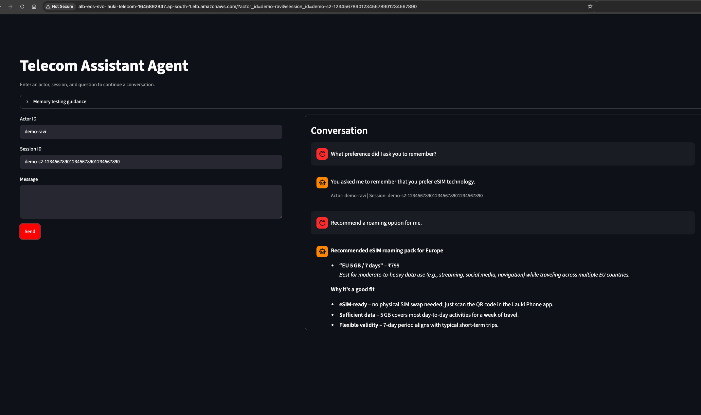
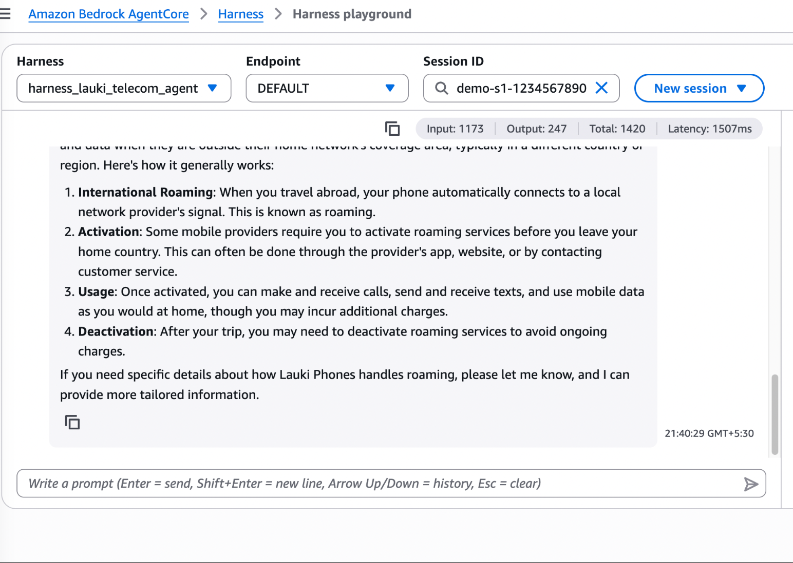

# 🤖 Lauki Phones Telecom Agent on Amazon Bedrock AgentCore

A **LangGraph telecom FAQ agent** for Lauki Phones, deployed on **Amazon Bedrock AgentCore Runtime** with **AgentCore Memory** (short-term checkpointing + long-term semantic memory), infrastructure provisioned with **Terraform**, and observability through **CloudWatch Logs**.

The agent answers telecom questions (plans, SIM/eSIM, roaming, billing, 5G bands, porting, ...) using RAG over the **Lauki Q&A dataset** (`data/lauki_qna.csv`), and remembers user preferences across sessions.

## ✨ What this project demonstrates

- **AgentCore Runtime** — production deployment of a LangGraph agent via the `bedrock-agentcore-starter-toolkit`
- **AgentCore Memory** — `AgentCoreMemorySaver` (short-term, per session) and `AgentCoreMemoryStore` (long-term, per actor) with pre/post model middleware hooks
- **RAG toolset** — FAISS + HuggingFace embeddings (`search_faq`, `search_detailed_faq`, `reformulate_query`)
- **Terraform** — IAM execution roles, ECR repository, AgentCore Memory (semantic strategy), CloudWatch log group
- **Zero hardcoding** — all non-sensitive config in `params.yml`, all secrets in `.env`

## 📁 Project Structure

```
langgraph-telecom-agent-bedrock-agentcore/
├── README.md                     # this file
├── pyproject.toml                # uv-managed dependencies
├── params.yml                    # ALL non-sensitive configuration
├── .env                          # sensitive values only (gitignored, create from .env.example)
├── .env.example                  # key names without values
├── .gitignore
├── data/
│   └── lauki_qna.csv             # telecom FAQ dataset (74 Q&A rows)
├── src/
│   ├── __init__.py
│   ├── logging.py                # logger factory (console + logs/agent.log)
│   ├── common.py                 # read_yml() -> ConfigBox, create_directories()
│   ├── config.py                 # merges params.yml + .env; the ONLY config entry point
│   ├── data_loader.py            # load_faq_csv(): CSV -> LangChain Documents
│   ├── vector_store.py           # HuggingFace embeddings + FAISS index (lazy singleton)
│   ├── tools.py                  # search_faq, search_detailed_faq, reformulate_query
│   ├── memory.py                 # AgentCoreMemorySaver/Store + MemoryMiddleware hooks
│   ├── agent.py                  # LLM (Groq) + system prompt + create_agent(...)
│   └── main.py                   # BedrockAgentCoreApp entrypoint
├── scripts/
│   ├── test_memory.py            # two-turn cross-session memory test
│   ├── run_dataset_eval.py       # batch-invoke the agent with dataset questions
│   └── tail_logs.py              # tail the runtime's CloudWatch log group
└── terraform/
    ├── versions.tf / providers.tf
    ├── variables.tf / terraform.tfvars
    ├── locals.tf                 # name prefix + random suffix (reference style)
    ├── iam.tf                    # runtime execution role + memory execution role
    ├── ecr.tf                    # ECR repository for the agent image
    ├── memory.tf                 # AgentCore Memory (event expiry + semantic strategy)
    ├── cloudwatch.tf             # runtime log group with retention
    └── outputs.tf                # memory_id, role ARN, ECR URL, log group
```

## ⚙️ Configuration Model (no hardcoded values)

| File | Contents | Loaded by |
|---|---|---|
| `params.yml` | Non-sensitive: region (`<YOUR_AWS_REGION>`), account ID, model name, temperature, embedding model, chunk sizes, retrieval `k`, memory name/expiry, log group prefix | `src/common.py::read_yml()` → `ConfigBox` |
| `.env` | Sensitive: `GROQ_API_KEY`, `AWS_PROFILE`, `MEMORY_ID`, `AGENT_RUNTIME_ARN` | `python-dotenv` in `src/config.py` |

Every module imports settings from `src/config.py` — there are **no literal values** in application code.

## 🛠️ Set-up & Pre-requisites

### System Requirements

- **Python**: 3.13 or newer (see [python.org/downloads](https://www.python.org/downloads/) to install)
- **Operating System**: Windows, macOS, or Linux
- **uv**: Ultra-fast Python package installer and resolver
- **Terraform**: 1.12.0 or newer

Check your Python version:
```bash
python --version
```

Install uv:
```bash
pip install uv
```
Or follow the [uv installation guide](https://docs.astral.sh/uv/getting-started/installation/)

### AWS Account & Credentials

- An **AWS account** with access to Amazon Bedrock AgentCore
- **AWS credentials** configured (see [AWS CLI Configuration](https://docs.aws.amazon.com/cli/latest/userguide/cli-configure-quickstart.html))
- Region set to `<YOUR_AWS_REGION>` (account `<YOUR_AWS_ACCOUNT_ID>` per `terraform/terraform.tfvars` and `params.yml`)

### API Keys

- **GROQ API Key**: Required for accessing the Groq LLM service
  - Sign up at [console.groq.com](https://console.groq.com)
  - Create an API key in your account settings
- **Hugging Face API Key**: Used for downloading the `sentence-transformers/all-MiniLM-L6-v2` embedding model

## Installation

### Step 1: Enter the Project

```bash
cd langgraph-telecom-agent-bedrock-agentcore
```

### Step 2: Install Dependencies

```bash
uv sync
```

This installs all dependencies specified in `pyproject.toml`.

### Step 3: Configure Environment Variables

```bash
cp .env.example .env
```

Fill in your keys:

```env
GROQ_API_KEY=your_groq_api_key_here
AWS_PROFILE=optional_profile_name
MEMORY_ID=          # filled in after terraform apply (step below)
AGENT_RUNTIME_ARN=  # filled in after agentcore launch
```
# AWS & Bedrock AgentCore Deployment Guide

## 1. AWS Configuration & Profile Setup

View all configured AWS profiles on your local machine:
```bash
aws configure list-profiles
```

Inspect local AWS CLI configuration settings:
```bash
cat ~/.aws/config
```

Inspect local AWS CLI credentials:
```bash
cat ~/.aws/credentials
```

Configure credentials and settings for the project profile:
```bash
aws configure --profile <YOUR_AWS_PROFILE_NAME>
```

Set the active AWS profile for the current terminal session:
```bash
export AWS_PROFILE=<YOUR_AWS_PROFILE_NAME>
```

Confirm the currently active AWS profile:
```bash
echo $AWS_PROFILE
```

Verify caller identity and authenticated account details:
```bash
aws sts get-caller-identity --profile <YOUR_AWS_PROFILE_NAME>
```

---

## 🏗️ 2. Provision Infrastructure with Terraform

All infrastructure lives in `terraform/` and follows the reference style: one `.tf` file per concern, values centralized in `terraform.tfvars`, and a `random_string` suffix in `locals.tf` to keep resource names unique.

Navigate to the Terraform configuration directory:
```bash
cd terraform_infra
```
Or,

```bash
terraform -chdir=terraform init   or, terraform -chdir=terraform init -upgrade
terraform -chdir=terraform plan
terraform -chdir=terraform apply
```

Resources created in **`<YOUR_AWS_REGION>`** (account **`<YOUR_AWS_ACCOUNT_ID>`**):

| Resource | Purpose |
|---|---|
| IAM role `...-runtime-execution-...` | Assumed by the AgentCore runtime: CloudWatch Logs, ECR pull, Memory data-plane, X-Ray |
| IAM role `...-memory-execution-...` | Assumed by AgentCore Memory to invoke the Titan embedding model for the semantic strategy |
| ECR repository | Stores the agent container image built by `agentcore launch` |
| AgentCore Memory | 30-day event expiry (short-term) + semantic strategy (long-term user preferences) |
| CloudWatch log group | `/aws/bedrock-agentcore/runtimes/<name>-DEFAULT` with 14-day retention |

Copy the outputs into `.env` (and keep them for the deploy step):

```bash
terraform -chdir=terraform output memory_id           # -> MEMORY_ID in .env
terraform -chdir=terraform output execution_role_arn  # -> used by agentcore configure
terraform -chdir=terraform output ecr_repository_url  # -> used by agentcore configure
```

Generate and save the Terraform execution plan:
```bash
terraform plan -out=langgraph-telecom-agent-bedrock-agentcore.tfplan
```

Apply the Terraform execution plan to provision the ECR repository, IAM execution roles, CloudWatch log group, and Bedrock AgentCore memory:
```bash
terraform apply langgraph-telecom-agent-bedrock-agentcore.tfplan
```
*(Or execute directly from root: `terraform -chdir=terraform apply`)*


## 3. Deploy the Agent on AgentCore Runtime

### Step 1: Local smoke test (optional but recommended)

```bash
uv run python -m src.main
```

In another terminal, invoke the local server:

```bash
curl -X POST http://localhost:8080/invocations \
  -H "Content-Type: application/json" \
  -d '{"prompt": "Explain roaming activation", "actor_id": "local-user", "session_id": "local-1"}'
```

### Step 2: Bedrock AgentCore Configuration

Configure Bedrock AgentCore runtime deployment, ECR container, execution role, and memory:
```bash
agentcore configure -e src/main.py \
  --region <YOUR_AWS_REGION> \
  --execution-role <execution_role_arn from terraform> \
  --ecr <ecr_repository_url from terraform>
```

This generates `.bedrock_agentcore.yaml` with the agent configuration.

### Step 3: Deploy the agent via agentcore

```bash
agentcore deploy --env GROQ_API_KEY=your_groq_api_key_here --env MEMORY_ID=<memory_id from terraform>
```

CodeBuild builds and pushes the image to ECR and creates the runtime — no local Docker required.

### Step 4: Invoke

```bash
agentcore invoke '{"prompt": "Explain roaming activation", "actor_id": "user-1", "session_id": "s-1"}'
```

Record the runtime ARN in `.env` as `AGENT_RUNTIME_ARN` (the scripts below use it).

### Step 5: Check AgentCore status (post deployment)

```bash
agentcore status
```

Output would be like below:
```
🔎 Retrieving memory resource with ID: lauki_telecom_agent_memory_.....
  Found memory: lauki_telecom_agent_memory_...

╭──────────────────────────────────────────────── Agent Status: lauki_telecom_agent_lang_runtime ────────────────────────────────────────────────╮
│ Ready - Agent deployed and endpoint available                                                                                                  │
│                                                                                                                                                │
│ Agent Details:       .......................................                                           
                        .......................................                                       
                        .......................................                                               
│                                                                                                                                                │
│ Ready to invoke:                                                                                                                               │
│    agentcore invoke '{"prompt": "Hello"}'  

```


**Payload contract** (unchanged from the course examples):

- Request: `{"prompt": str, "actor_id"?: str, "session_id"?: str}`
- Response: `{"result": str, "actor_id": str, "thread_id": str}`

## 🧠 4. Verify Memory (short-term + long-term)

`scripts/test_memory.py` proves cross-session long-term memory:

1. **Turn 1** (actor `A`, session `S1`): `"My name is Ravi, remember it."`
2. **Turn 2** (actor `A`, **new** session `S2`): `"What is my name?"`

Only long-term AgentCore Memory can answer turn 2:

```bash
uv run python -m scripts.test_memory   
```
**Output:**
```text
2026-09-12 19:26:31,565 - lauki-telecom-agent - INFO - yml file: /Users/xxxxxx/langgraph-telecom-agent-bedrock-agentcore/params.yml loaded successfully
2026-09-12 19:26:31,706 - lauki-telecom-agent - INFO - Turn 1 (actor=memory-test-user-2efe28f6, session=18e6ea56-d582-4c2e-ac07-f0efd612a7ca)
2026-09-12 19:26:42,575 - lauki-telecom-agent - INFO - Turn 1 response: Got it, Ravi! I’ll keep that in mind for our future chats. If you have any questions about Lauki Phones, just let me know!
2026-09-12 19:26:42,575 - lauki-telecom-agent - INFO - Waiting 90 seconds for AgentCore semantic memory processing
2026-09-12 19:28:12,576 - lauki-telecom-agent - INFO - Turn 2 (actor=memory-test-user-2efe28f6, session=246fc11f-cd26-4031-9e7a-a527078b0247)
2026-09-12 19:28:14,732 - lauki-telecom-agent - INFO - Turn 2 response: Your name is Ravi.
✅ MEMORY TEST PASSED — agent recalled the name across sessions
```


## 📊 5. Verify with the Dataset

Batch-invoke the agent with questions from `data/lauki_qna.csv` and compare against reference answers:

```bash
uv run python scripts/run_dataset_eval.py --num 5
```
**Output:**
```text
2026-09-12 20:16:35,551 - lauki-telecom-agent - INFO - yml file: /Users/xxxxxx/langgraph-telecom-agent-bedrock-agentcore/params.yml loaded successfully
2026-09-12 20:16:35,613 - lauki-telecom-agent - INFO - Invoking: What plans do Lauki Phones offer?
2026-09-12 20:16:46,160 - lauki-telecom-agent - INFO - Invoking: How do I activate a new SIM?
2026-09-12 20:16:56,042 - lauki-telecom-agent - INFO - Invoking: How long does activation take?
2026-09-12 20:17:06,033 - lauki-telecom-agent - INFO - Invoking: Does Lauki Phones support eSIM?
2026-09-12 20:17:14,752 - lauki-telecom-agent - INFO - Invoking: How do I switch from physical SIM to eSIM?
Wrote 5 results to /Users/xxxxxx/langgraph-telecom-agent-bedrock-agentcore/logs/dataset_eval_results.json
```

## 🔍 6. Observe in CloudWatch Logs

Every entrypoint invocation prints the received payload, retrieved memories, and the result. These land in `/aws/bedrock-agentcore/runtimes/<runtime-id>-DEFAULT`:

```bash
uv run python scripts/tail_logs.py --minutes 15
```
Or in the console: **CloudWatch → Log groups → /aws/bedrock-agentcore/runtimes/** — confirm the `Received payload`, `Retrieved memories`, and `Result` lines for each invocation.

## 7. Frontend Application Execution

Launch the Streamlit chat UI locally for user interactions:
```bash
uv run streamlit run src/frontend.py
```

Run Streamlit in containerized environments for ECS Fargate compute:
```bash
streamlit,run,src/frontend.py,--server.address=0.0.0.0,--server.port=8501
```
*(Added as container command for ECS Fargate compute run)*

---

## Application Deployment Proof

<br>

<h1 align="center">📝 Agent Long Term Memory persist </h1>
<p align="center">
  
</p>
---

<br>

<h1 align="center">📝 Cross-Actor Memory Isolation </h1>
<p align="center">
  
</p>
---

<br>

<h1 align="center">📝 Bedrock AgentCore Harness Playground </h1>
<p align="center">
  
</p>
--- 


## ⚙️ Troubleshooting

### Issue: Python version error
**Solution**: Ensure you have Python 3.13 or newer installed:
```bash
python --version
```

### Issue: Missing `GROQ_API_KEY`
**Solution**: Verify your `.env` file contains the key and is in the project root:
```bash
cat .env
```

### Issue: FAISS installation fails
**Solution**: Install the CPU version explicitly:
```bash
uv pip install --upgrade faiss-cpu
```

### Issue: AWS credentials not found
**Solution**: Configure AWS credentials using AWS CLI:
```bash
aws configure
```

### Issue: `MEMORY_ID is not set` when running scripts
**Solution**: Run `terraform -chdir=terraform output memory_id` and copy the value into `.env`.

### Issue: terraform `awscc_bedrockagentcore_memory` fails
**Solution**: Verify the `hashicorp/awscc` provider installed correctly (`terraform -chdir=terraform init` again) and that AgentCore is available in `<YOUR_AWS_REGION>` for your account.

### Issue: Bedrock AgentCore Memory & Model Verification

Retrieve configuration details and active strategies for the AgentCore memory resource:
```bash
aws bedrock-agentcore-control get-memory \
  --memory-id lauki_telecom_agent_memoryxxxx-eSGYywEFhX \
  --region <YOUR_AWS_REGION> > quick_error.txt
```

### Issue: Search and retrieve memory records stored under a specific actor namespace:

```bash
aws bedrock-agentcore retrieve-memory-records \
  --memory-id lauki_telecom_agent_memoryxxxx-eSGYywEFhX \
  --namespace "/preferences/memory-test-user-be0487e1" \
  --search-criteria '{"searchQuery":"user name","topK":10}' \
  --region <YOUR_AWS_REGION> >> quick_error.txt
```
 
### Issue: Invoke Amazon Titan Text Embeddings V2 model to verify embedding runtime availability:
```bash
aws bedrock-runtime invoke-model \
  --model-id amazon.titan-embed-text-v2:0 \
  --body '{"inputText":"test"}' \
  --cli-binary-format raw-in-base64-out \
  --region <YOUR_AWS_REGION> >> quick_error.txt
```

### Issue: Query memory status, failure reason, IAM role, and strategy status using JMESPath:
```bash
aws bedrock-agentcore-control get-memory \
  --memory-id lauki_telecom_agent_memoryxxxx-eSGYywEFhX \
  --region <YOUR_AWS_REGION> \
  --query 'memory.{status:status,failureReason:failureReason,role:memoryExecutionRoleArn,strategies:strategies[*].{id:strategyId,name:name,status:status}}' \
  --output json
```

## 📚 Additional Resources

- [Amazon bedrock AgentCore](https://aws.amazon.com/bedrock/agentcore/?trk=33dad69a-efe5-4eb8-b3eb-bfdc0cf9a3c0&sc_channel=el)
- [Amazon Bedrock AgentCore Documentation](https://docs.aws.amazon.com/bedrock-agentcore/latest/devguide/agentcore-get-started-toolkit.html/?trk=33dad69a-efe5-4eb8-b3eb-bfdc0cf9a3c0&sc_channel=el)
- [Amazon Bedrock Agentcore Samples](https://github.com/awslabs/amazon-bedrock-agentcore-samples)

---
Copyright©️ Codebasics Inc. All rights reserved.

### TODO for later:
-----------
1. Implement Bedrock Guardrails
2. Expose Langraph tools externally as MCP servers and bind them with AgentCore Gateway
3. Separate Terraform infra setup: ECS Cluster + Fargate compute (Servies + Task Definitions) + ALB